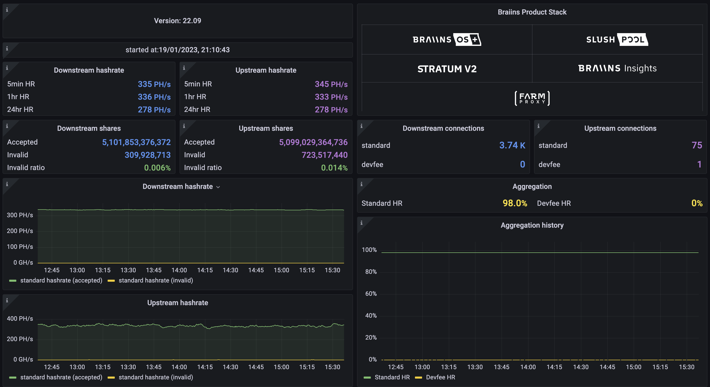

# License

Any content in this repository is released under our proprietary License. The current version of the License is available in this repository in a separate [file](LICENSE.md), and can be also accessed at the following website: https://braiins.com/farm-proxy/license.

By downloading, copying, installing, or otherwise using all or any content from this repository, you accept all the terms and conditions set out in the License, so please, read the License carefully. If you do not agree with any of the terms and conditions of the License, do not use any content from this repository and delete or destroy any such content that is already in your possession or control.

Please, keep in mind that the License automatically renews every month and from time to time it can be changed or amended, so revisit the License regularly to keep track of any changes. The date when the License was last materially changed or amended is listed in the header of the License for convenience.

If you have any other questions, please contact us at info@braiins.com.

## Introduction
Braiins is providing to the mining world a free hashrate aggregation proxy **Braiins Farm Proxy**. Braiins Farm Proxy encompasses four primary components:
* Farm Proxy
* Configurator (headless, GUI)
* Prometheus
* Grafana

Go to [Braiins Academy](https://academy.braiins.com/en/farm-proxy/about) for the full documentation.



# Quick Start
1. Clone the git repository `git clone https://github.com/braiins/farm-proxy.git`
2. Go to the farm-proxy repository `cd farm-proxy`
3. Optional: Create your preferred farm proxy settings from CLI in this step, or use GUI in step 8 (see section [Configuration](#configuration))  
5. Run the service stack with the command `docker compose up -d`
6. Verify that farm-proxy is running `docker ps`
7. Open URL http://localhost:3000 to see the Client Dashboard in Grafana
8. Open URL http://localhost:7777 to manage Farm Proxy configuration via GUI
9. Connect miners to the Braiins Farm Proxy (fill in the proxy URL `stratum+tcp://<your_host:port>` to the pool settings of the miners)

## Updating Farm Proxy
If you already have Farm Proxy installed and you want to update it to the latest version, you can use the following guide:
1. Go to the farm-proxy repository `cd farm-proxy`
2. Backup your custom configuration in folder `config`
3. Pull the latest version of Farm Proxy with `git pull`   
Note: this can overwrite your current configuration, so make sure you have a backup
4. Restore your configuration by either:
    1. Copying it directly to the file `./config/active_profile.toml`
    2. Copying it to the `./config` directory and then making it active from GUI after you start Farm Proxy
5. Start Farm Proxy with `docker compose up -d`

## Farm Proxy Distribution
Farm Proxy can be currently run on Linux OS as a multiplatform software:
* AMD 64bit
* ARM 64bit
* ARMv7

## Prerequisites
At the beginning it is required to install a couple of prerequisites:
* [Docker](https://www.docker.com/get-started/)
* [Docker Compose](https://docs.docker.com/compose/install/linux/)
* [Git](https://git-scm.com/downloads)

# Configuration
* Farm Proxy can be configured via CLI or via GUI.
* Farm Proxy config files are located in directory `./config` and they have be TOML files.
* Individual config files are called and referred to as profiles.
* Profile loaded at startup is `./config/active_profile.toml`
* If FP is run alone as a single service `docker compose up -d farm-proxy`, it either uses configuration that it used the last time or, if docker volumes are empty, waits for manual configuration (see below).

Farm Proxy may be reconfigured while it is running. There are two ways to reconfigure running FP:
1. Via farm-proxy-configurator - that's oneshot docker container that reads a config file in the `./config/active_profile.toml` directory and configures the running (or starting up) FP service.
Running `docker compose up -d farm-proxy-configurator` will reload configuration of FP.
2. Via farm-proxy-gui service - by manually editing the configuration in a graphical user interface in a web browser (available on http://localhost:7777) and saving it.


### CLI configuration
1. Copy a `./config/templates/01_minimal.toml` config profile to the `./config/active_profile.toml`
2. Edit the file: Define your upstream pool, username and optionally other desired settings. Make sure you specify your pool username so that hash rate is routed to correct pool account.
3. Start the Farm-Proxy stack with `docker compose up -d`

Unless the volumes are pruned with `docker volume prune` or `docker compose down -v`, FP always caches and initially loads the config it was last running with.  
**Important note:** if you set up a profile via GUI and you plan to use only CLI option for setting up configuration, it is recommended to delete file `./config/.profile`. This file contains name of active configuration for GUI that can override your configuration manually set up in file `./config/active_profile.toml` via CLI.

### GUI configuration 
When Farm Proxy is running, you can use GUI (available on http://localhost:7777) to configure it.
GUI allows you to manage user profiles (create/edit/delete) and select which profile will be active.
After you save a corresponding profile, it will be created in folder `./config` as a TOML file with name of the profile.
On page http://localhost:7777/settings you can create a new profile with 3 different ways:
1. As a blank profile that will be edited via GUI
2. As a predefined profile that will be created from configuration templates and later edited
3. As a profile that you import from already existing toml file

Note: when running GUI for the first time, GUI can incorrectly state that no profile is active, evne when profile set up with CLI is already active. This is known limitation that is bypassed as soon as you select an active config via GUI.  
For advanced users: if you know you don't want to use GUI to configure Farm Proxy, you can disable GUI entirely in file `docker-compose.yml` by deleting/commenting out component *farm-proxy-gui* to save some resources.

### Braiins Telemetry Configuration
Since Braiins Farm Proxy version 23.01, telemetry data are collected in order to be able to track technical issues, errors and future improvements of the application. In case the user doesn't want to send telemetry data to Braiins, he can opt out. Just disable telemetry from GUI configuration or add following lines to the proxy configuration manually:

```
[telemetry]
enable_farm_metrics_telemetry = false
```
